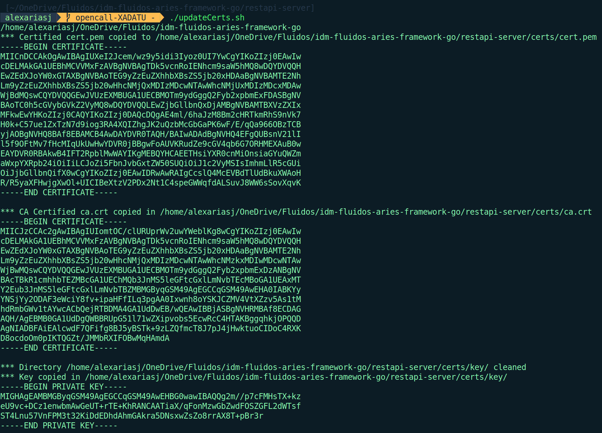

# FabricRest-GO

# Overview
This project contains the source code for a REST API server written in Go, designed to interact with Smart Contracts deployed on a Hyperledger Fabric network. The REST API facilitates seamless integration with the blockchain by leveraging Application Gateways—dedicated services that connect to Hyperledger Fabric and execute Smart Contract functions.

The Application Gateways establish secure SSL channels with a specific peer within the Hyperledger Fabric network and communicate via gRPC to invoke Smart Contract operations. This architecture ensures a secure, scalable, and reliable connection between the REST API and the blockchain.

The Application Gateways are the exclusive means of communication with Hyperledger Fabric from outside the network, ensuring that the REST API server provides a robust interface for interacting with blockchain-based assets and logic.

# Prerequisites
The following prerequisites are required to run a Docker-based REST-API for Hyperledger Fabric:

* **Git**: install the latest version of Git if it is not already installed.

  ```bash
  $ sudo apt-get install git
  ```

* **Docker**: install the latest version of Docker if it is not already installed.

    ```bash
    $ sudo apt-get -y install docker-compose
    ```

    Once installed, you can confirm that the latest versions of both Docker and Docker compose executables were installed by running:

    ```bash
    $ docker --version
    Docker version 24.0.6, build ed223bc
    $ docker-compose --version
    docker-compose version 1.29.2, build unknown
    ```

    Make sure the Docker daemon is running

    ```bash
    $ sudo systemctl start docker
    ```

    To start the Docker daemon when the system starts, use the following:
    
    ```bash
    sudo systemctl enable docker
    ```

    Add your user to the Docker group.
    ```bash
    sudo usermod -a -G docker <username>
    ```

    After this, you must restart your session for changes to be applied. You can restart your PC or just close your session.

## **Hyperledger Fabric Certificates**

Update Hyperledger Fabric certificates to connect your Fabric deployment. There are two different procedures depending on `Hyperledger Fabric` and `REST API` are going to be deployed on the same machine or not. 

In this sense:

### Same machine

**IMPORTANT:** The script referended in this subseccion uses the information of `.env`, please define correctly the environment variables before execute it.

If you have deployed Hyperledger Fabric on the same machine on which you are going to deploy the REST-API, execute the following command:

```bash
$ ./updateCerts.sh
```

This will automatically copy the certificates from Hyperledger Fabric into the REST-API.

If everything works as expected, you should see the following ouput:



### Different machine

If your Hyperledger Fabric deployment is on a different machine, you will have to manually copy the certificates:

1. **CA CERT**: Copy the CA certificate from ``../modules/fabric-samples/test-network/organizations/peerOrganizations/org1.example.com/peers/peer0.org1.example.com/tls/ca.crt``to ``certs/ca.crt``.

2. **USER CERT**: Copy the user cert from ``../modules/fabric-samples/test-network/organizations/peerOrganizations/org1.example.com/users/User1@org1.example.com/msp/signcerts/cert.pem`` to ``certs/cert.pem``

3. **USER KEY**: Copy the user private key from ``../modules/fabric-samples/test-network/organizations/peerOrganizations/org1.example.com/users/User1@org1.example.com/msp/keystore/<keyName>`` to ``certs/key/`` where ``<keyName>`` is the name assigned to the key for that Fabric deployment.

**NOTE**: The directory ``FabricREST-Go/certs/key/`` should be empty before copying the key, so if it is not empty please delete all keys. If you are executing the script ``./updateCerts.sh`` you do not have to worry about this, as the script will delete all keys in the ``certs/key``directory.

# Run

To run the REST-API server, you can use the provided Makefile with the following commands:

```bash
# To start the model treatment service (including building and running Docker containers)
$ make run-model-treatment

# To stop the model treatment service
$ make stop-model-treatment

# To clean up the environment (stop containers and remove volumes)
$ make clean
```

The `run-model-treatment` command will:
1. Run the `updateCerts.sh` script to update the certificates
2. Build the Docker containers
3. Start the Docker containers

Example of successful execution:


This will launch the REST-API server on port 3005.

To access the logs, execute:

```bash
$ docker-compose logs -f api
```

# Endpoints
Folder [postman](./postman/) contains a JSON file that can be exported to POSTMAN to test all endpoints described below:

## 1. XACML

### 1.1 **Register Policies or Attributes**
- **Endpoint**: /ngsi-ld/v1/entities/
- **Method**: POST
- **Headers**:
    - **Content-Type**: application/json
- **Body**: ``<json>`` (where 'json' is the JSON of the policy or attribute that is going to be registered in Blockchain)
- **Description**: Register Policies or Attributes indicated in the request body in Blockchain.

### 1.2 **Get all Policies or Attributes from all domains**
- **Endpoint**: /ngsi-ld/v1/entities/?type=``<type>``
- **Method**: GET
- **Query Parameters**:
    - **type**: ``<type>`` (where 'type' can be 'xacml' for policies or 'attributes' for attributes')
- **Description**: Retrieve all policies or attributes stored in Blockchain from all domains defined in XACML.

### 1.3 **Update Policies or Attributes**
- **Endpoint**: /ngsi-ld/v1/entities/``<entity>``/attrs
- **Method**: PATCH
- **Query Parameters**:
    - **entity**: ``<entity>`` (where 'entitiy' is the id of the policy or attribute, e.g., 'urn:ngsi-ld:xacml:test' can be the id of a policiy for the domain 'test' and 'urn:ngsi-ld:attribute:test' the id of the attributes for the domain 'test')
- **Headers**:
    - **Content-Type**: application/json
- **Body**: ``<json>`` (where 'json' is the JSON of the policy or attribute that is going to be updated in Blockchain)
- **Description**: Update Policies or Attributes indicated in the request body in Blockchain.

### 1.4 **Get Policies or Attributes for a specific domain**
- **Endpoint**: /ngsi-ld/v1/entities/``<entity>``
- **Method**: GET
- **Query Parameters**:
    - **entity**: ``<entity>`` (where 'entitiy' is the id of the policiy or attribute to be retrieved from Blockchain, e.g., 'urn:ngsi-ld:xacml:test' to retrieve the policies for the domain 'test')
- **Description**: Retrieve Policies or Attributes from a specific domain from Blockchain.

## 2. FLUIDOS

### 2.1 **Register authorization request**
- **Endpoint**: /xadatu/auth/register
- **Method**: POST
- **Headers**:
    - **Content-Type**: application/json
- **Body**: ``<json>`` (where 'json' is the JSON of the authorization request to be registered in Blockchain)
- **Description**: Register the authorization request received in XACML in the Blockchain. It includes the verdict from the XACML.

### 2.2 **Query authorization request**
- **Endpoint**: /xadatu/auth/``<id>``
- **Method**: GET
- **Query Parameters**:
    - **id**: ``<id>`` (where 'id' is the ID of the authorization request to be retrieved from Blockchain)
- **Description**: Query an authorization request from the Blockchain.

### 2.3 **Query authorization requests by date**
- **Endpoint**: /xadatu/auth/queryByDate
- **Method**: GET
- **Headers**:
    - **Content-Type**: application/json
- **Body**: ``<json>`` (where 'json' is a JSON with two fields, 'startDate' to indicate the starting date in ISO format, and 'endDate' to indicate the end date in ISO format)
- **Description**: Query all authorization requests between the two dates indicated in the request body.
