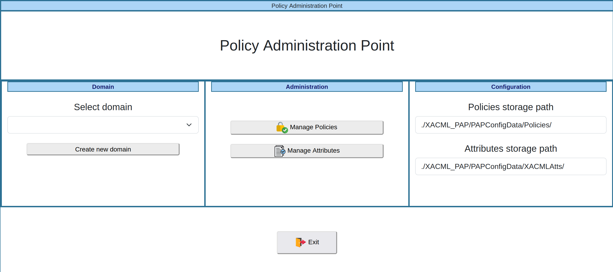
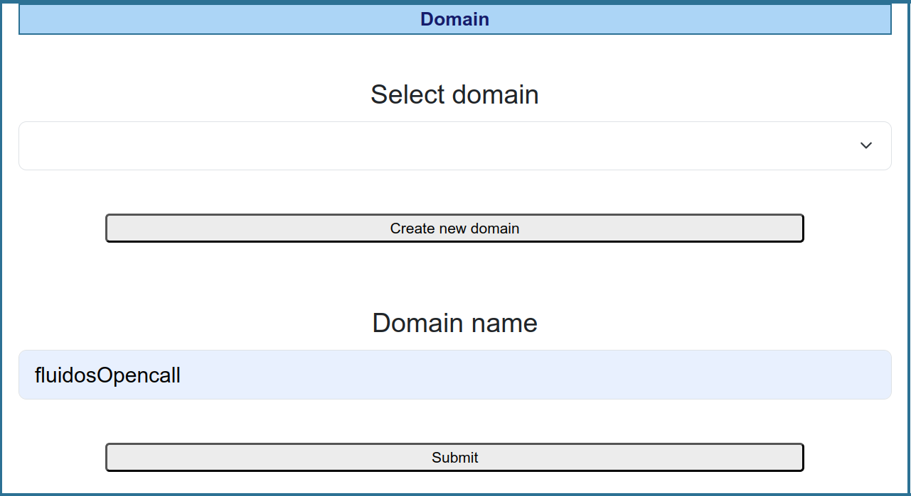
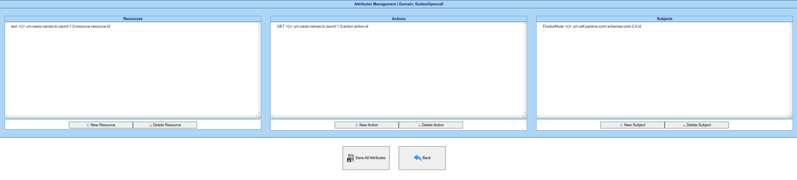
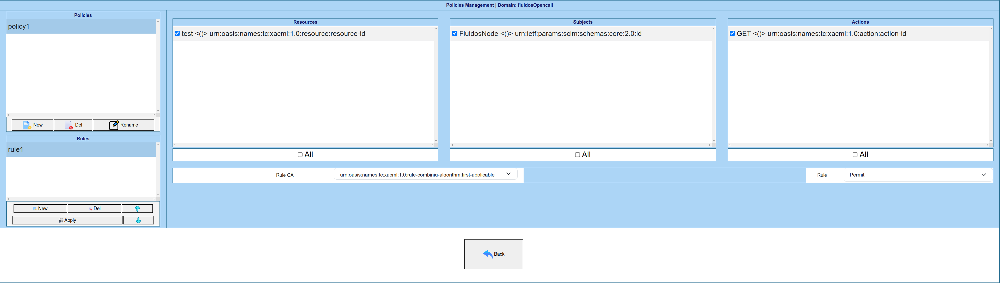

# License

XACML-MULTIDOMAIN project source code files are made avaialable under the Apache License, Version 2.0 (Apache-2.0), located into the LICENSE file.

# What is a XACML-MULTIDOMAIN

This element corresponds to the implementation of the XACML framework. It comprises:

- Policy Administration Point (PAP) which is responsible for managing the authorisation policies (XACML) of multiple domains which are defined according to a triplet (subject, resource, action). It is made up of two developments:

    - a Frontend, that offers a Graphic User Interface (GUI), is in VueJS version (Javascript framework). 
    - a Backend is in Python version, accessible by the Frontend via an Application Programming Interface (API).

- Policy Decision Point (PDP), in Python version, responsible for issuing possitive/negative verdicts whenever an authorisation request is received.

## Project details

This project consist on the next files/folders:

1. [XACML_DATA](./XACML_DATA/): Contains the data stored by the PAP-Backend (XACML authorisation policies XACML).

2. [xacml-pap-frontend](./xacml-pap-frontend/): Offers a web environment to manage XACML authorisation policies XACML which are based on subjects, actions and resources and policies (PAP-Frontend).

3. [xacml-pap-backend](./xacml-pap-backend/): Offers an API that allows to store the configuration defined by the security administrator (XACML authorisation policies) in the PAP-Frontend (PAP-Backend).

4. [XACML_PDP_PYTHON](./XACML_PDP_PYTHON/): Offers an endpoint to verify if a subject can perform an action over a specific resource through XACML authorisation policies (PDP). (DEPRECATED - It provides also the endpoint to obtain the attribute list required to define the presentation required in scenarios where a verifier credentials element is present).

Files to deploy the component:

- [docker-compose.yml](./docker-compose.yml): To deploy all the components (PAP and PDP).
- [.env](./.env): Configuration file for environment variables of PAP and PDP.

- File to monitor.
    
    - [monitor_PAP_Backend.sh](./monitor_PAP_Backend.sh): To test if the PAP-Backend component is running or not.
    - [monitor_PAP_Frontend.sh](./monitor_PAP_Frontend.sh): To test if the PAP-Frontend component  is running or not.
    - [monitor_PDP_Py.sh](./monitor_PDP_Py.sh): To test if the PDP component (Python) is running or not.

- File to clean docker logs.

    - [deleteLogs.sh](./deleteLogs.sh): To clean logs of the component (registered and used by docker).
    **NOTE:** This script remove the logs of all dockerized services present in the machine not only the logs of XACML Framework. 

# How to deploy

## Prerequisites to deploy XACML Framework

To run this component is neccessary to install the docker-compose tool.

https://docs.docker.com/compose/install/

## Configuration SujectIdTypes.json file

Review the contain of [XACML_DATA/PAPConfigData/SujectIdTypes.json](./XACML_DATA/PAPConfigData/SujectIdTypes.json) to configure the execution the subject types that can be defined in the XACML authorization policies. 

**NOTE:** This file contains pairs of elements that map the subject type that an external component can send (subjectIdCapMan) and the internal subject type defined in the XACML authorization policies (subjectIdPAP). 

## Configuration .env and docker-compose.yml files

Review the contain of [.env](./.env) and [docker-compose.yml](./docker-compose.yml) to configure the execution. Focusing on [.env](./.env) file, which contains the environment variables of the different elements. 

Replace ``<restapi-ip>`` with the ``IP`` where the REST API server is deployed in the ``.env`` file.

# Installation / Execution.

After the review of the configuration files of the `How to deploy` section, the next step is to obtain the docker images. To do this:

```sh
docker-compose build
```

Finally, to launch images:

```sh
docker-compose up -d
```

# Configure XACML for testing 

XACML-PAP, as mentioned above, it’s a GUI for managing XACML policies (configuration), it’s not interfering in the obtaining authorisation requests verdict. 



Before defining attributes and policies, a domain must be created or selected. The domain is free to align with different concepts like host, virtual machine, partner, application, service, etc... it depends on the high-level concept chosen to create different XACML authorization policies. Clicking "Create new domain" will allow you to create and include a new domain in the selector element of the "Domain panel".

For testing the 'fluidos-idm' functionality, create the domain ``fluidosOpencall``




Once the domain is choosen or created, click “Manage Attributes” button (Administration panel) to define the resources, actions and subjects. To save click “Save All Attributes” and “Back”.

For testing the 'fluidos-idm' functionality, create the following attributes:

- **Resource**: create the resource ``test`` on the ``Type Resource Name`` field. Do not modify the ``Type Resource ID`` field.

- **Action**: create the action ``GET`` on the ``Type Action Name`` field. Do not modify the ``Type Action ID`` field.

- **Subject**: create the subject ``FluidosNode`` on the ``Type Subject Name`` field. Select ``urn:ietf:params:scim:schemas:core:2.0:id`` on the ``Type Subject ID`` field.



Finally, click “Manage Policies” button (Administration panel) to define the policies. Here you can see all attributes defined previously. In this page you must define Policies and into them rules. Each rule can link resources, actions and subjects and establish if this combination is “Permit” or “Deny”.

For testing the 'fluidos-idm' functionality, create the following policy and rule:




# How to monitoring.

- To test if containers are running:

```sh
docker ps -as
```

The system must return that the status of the containers is up.

- To show the XACML-PAP-Backup container logs.

```sh
docker-compose logs -f xacml-pap-backend
```

- To show the XACML-PAP-Frontend container logs.

```sh
docker-compose logs -f  xacml-pap-frontend
```

- To show the PDP (Python) container logs.

```sh
docker-compose logs -f  xacml-pdp
```

# Troubleshooting

**If the certificates were renovated and "PDP_Protocol"="https", you need to refresh them in PDP service (Python). Once certificate files are ubicated at the corresponding folder following prerequisites indications, access to the project directory and run:**

```bash  
docker-compose restart xacml-pdp
```

To solve it automatically, you must add something like this in the crontab, to restart the component each 4 hours:
```
0 0,4,8,12,16,20 * * * cd {{projectFolder}}; docker-compose restart xacml-pdp
```

**RECOMMENDED, monitor each minute, through crontab, if several security components are running:**

```
#To monitor PAP-Backend.
* * * * * cd {{projectFolder}}; ./monitor_PAP_Backend.sh >> nohup_PAP_Backend.out 2>&1

#To monitor PAP-Frontend.
* * * * * cd {{projectFolder}}; ./monitor_PAP_Frontend.sh >> nohup_PAP_Frontend.out 2>&1

#To monitor PDP (Python).
* * * * * cd {{projectFolder}}; ./monitor_PDP_Py.sh >> nohup_PDP_Py.out 2>&1
```
*NOTE:* Before configure it, be sure to define:

- {{Protocol}}://{{IP}}
- {{projectPath}}

**RECOMMENDED, to prevent PDP (Python) logs from filling up the hard drive include in crontab to clean the logs periodically. --> Logs stored in the container of PDP (Python).**

```
#To remove PDP (Phyton) logs.
0 0 * * 6 cd {{projectFolder}}; cat /dev/null > pdp.log
```

**RECOMMENDED, to prevent XACML logs from filling up the hard drive include in crontab to clean the logs periodically. --> Logs stored by docker technology related to services.**

**NOTE:** This script remove the logs of all dockerized services present in the machine not only the logs of XACML.

```
# Assign permissions
sudo chmod 755 deleteLogs.sh

# Copy to /usr/bin
sudo su
cd /usr/bin/
cp {{projectFolder}}/deleteLogs.sh ./

# Configure schedule in /etc/crontab
cd /etc
vi crontab
  # Add this line
  0 0     * * 6   root    /usr/bin/deleteLogs.sh
```

# PAP FRONTEND - User Graphic Interface (GUI)

Access to PAP through a web explorer to `http://localhost:9091/pap/`. You will see the main webpage of the PAP service.